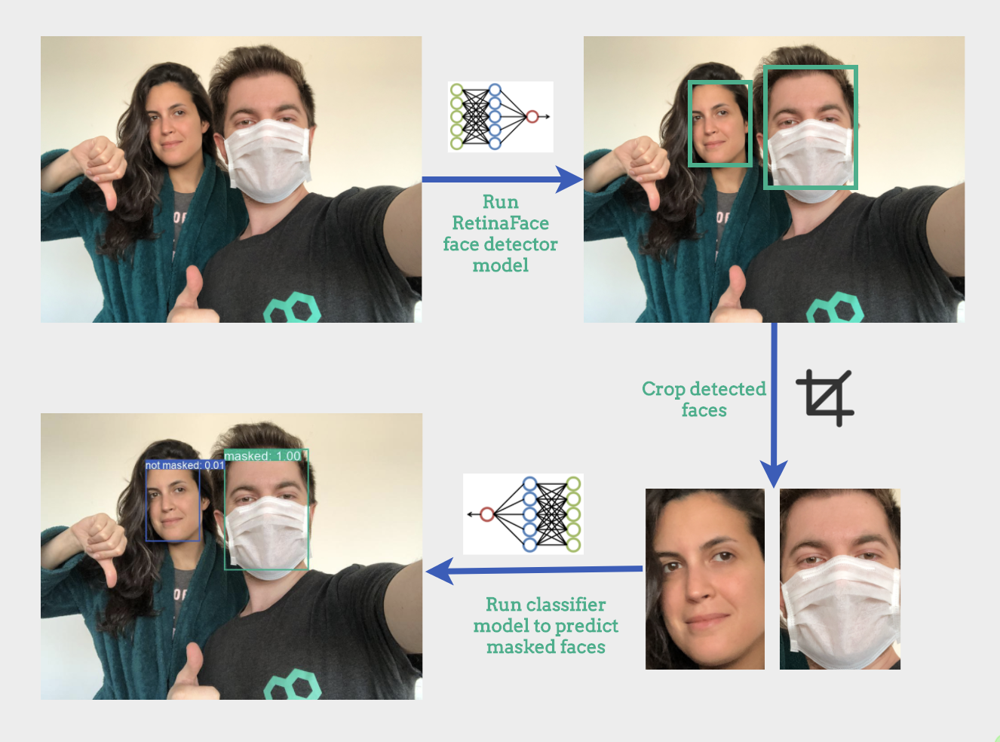
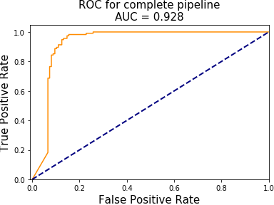
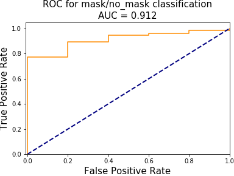

[](https://dataroots.io)
 
# Face Mask Detection
Face masks are crucial in minimizing the propagation of Covid-19, and are highly recommended or even obligatory in many situations. In this project, we develop a pipeline to detect unmasked faces in images. This can, for example, be used to alert people that do not wear a mask when entering a building.

Our pipeline consists of three steps:
  1. We detect all human faces in an image
  2. We make a mask/no_mask prediction for each of them
  3. We return an annotated image with the predictions


## General Model Workflow



### Technologies
* Python 3.7
* Tensorflow2 / Keras

### Data collection
Our training data is based on the [VGGFace2 dataset](http://www.robots.ox.ac.uk/~vgg/data/vgg_face2/). This dataset provides a collection of faces that are captured in the wild with different ethnicities, ages and emotions. We use 4941 images of this dataset, and apply an artificial masks to half of them. This data will be used to train our mask/no_mask classifier.

Our validation and testing data consists of images of people with and without masks that we collected from various sources that provide images with permissive licences (e.g. [pexels.com](www.pexels.com), [unsplash.com](www.unsplash.com)). We have manually annotated all faces in the collected images, and labeled them as being masked or not (using the [makesense.ai](https://www.makesense.ai/) annotation tool). We collected 273 images which contain 524 faces (many images contain multiple faces). 246 faces are masked and 278 are non-masked. These faces are split 50/50 over the validation set and test set. An overview of the collected data and corresponding URLs and ground truth annotations can be found in [test_validation_metadata.csv](data/test_validation_metadata.csv).

### Data preprocessing
Labeled data of masked faces is hard to come by, which is why we decided to set the overall still limited set of real masked faces that we have collected apart for validation and testing. Artificially generated masks that are used for training are generated as follows:

  1. Detect the face in the image
  2. Find the face landmarks, more specifically we need the location of the nose and chin
  3. Apply an image of a mask to the face with the position based on the face landmarks

This strategy is based on the description that you can find in the [prajnasb/observations repository](https://github.com/prajnasb/observations).
We apply 13 masks with different shapes and colors to generate training data, which you can find in [data/mask-templates](data/mask-templates). Below you can see an example of a mask being artificially applied.


### Data Folder Structure
```
data
├── classifier_model_weights   # The pre-trained classifier model weights
├── fonts  # Font directory to annotate and label the input image
├── mask-templates # Template mask images to artificially create masked faces
├── raw_images # Raw images to generate validation/test set
├── sampled_face_images # Sampled face images from VGGFace2 dataset
├── test # Test set to evaluate mask classifier model
│   ├── masked
│   └── not_masked
├── train # Train set to train mask classifier model
│   ├── masked
│   └── not_masked
└── validation # validation set to train validation classifier model
    ├── artificial
    │   ├── masked
    │   └── not_masked
    └── real
        ├── masked
        └── not_masked
```

### Face Detection
We used the RetinaFace face detector to extract faces as it is the state-of-the-art in face localisation in the wild, and works in real-time on a single CPU core [(Deng et al.)](https://arxiv.org/abs/1905.00641). We used the implementation and pre-trained model available at the [retinaface-tf2 repository](https://github.com/peteryuX/retinaface-tf2).

### Masked or Not Masked Classification
The model that we train to distinguish between masked and non-masked cropped faces consists of a MobileNetV1 base followed by 1 fully connected layer and a final output layer with sigmoid activation. We use ImageNet pre-trained weights for the MobileNetV1 base, and only finetune the final 4 layers of the complete model. Only VGGFace2 non-masked and artificially masked data is used for training. We use two validation sets:
  1. One consisting of VGGFace2 non-masked and artificially masked data
  2. One consisting of real masked and unmasked faces from the set that we have collected ourselves.

This allows us to keep track of performance on artificial and real data separately. The final test set evaluation is only performed on **real data**.

### Model Performance

#### Overall evaluation

Our test set of 135 images contains 249 faces, of which 130 are unmasked.

The following table summarizes the performance of the complete pipeline (i.e. the face detector followed by the classifier). We apply the mask/no_mask classifier to the cropped faces extracted by the face detector, and compare the resulting labels to the ground-truth labels of matching ground-truth face bounding boxes. A predicted face bounding box matches a ground truth bounding box if their intersection over union (IoU) > 0.5.


|    |      ground truth      |  identified and classified correctly | identified but classified wrongly | not identified by detector |
|----------|:-------------:|------:| ------:|------:|
| masked faces |  119 |  95 | 14 | 10 |
| unmasked faces |    130   |   115 | 7 | 8  |


The two most relevant metrics are the true negative rate (TNR) and the false negative rate (FNR). The first one tells us how many of the unmasked faces we detect, and the second one how many times we incorrectly identify an unmasked face. 115 of the 130 unmasked faces were identified correctly, resulting in a **true negative rate (TNR) of 88.5%**. 14 of the 119 masked faces were incorrectly identified as unmasked, resulting in a **false negative rate (FNR) of 11.8%**. The pipeline also incorrectly identified 15 faces that did not match any face in the ground truth, 7 of them were subsequently classified as non-masked and 1 as masked.

While the previous statistics correspond to a mask/no_mask classification threshold at 0.5, we can of course vary this to trade off between better TNR or FNR. The following figure shows the ROC curve for the pipeline. For the generation of this ROC curve, we considered ground truth faces that were not detected by the face detector to be predicted as masked. After all, the aim is to detect unmasked faces so if the detector is not detecting any face it will have the same effect as predicting masked. Faces that are detected by the face detector but that don't exist in the ground truth were not taken into account in this ROC curve. 


#### Evaluation of the face detector

The face detector correctly identifies 95.9% of the ground truth faces in the test set (i.e. for 255 out of 266 ground truth bounding boxes there is a predicted bounding box with an IoU > 0.5). Of the 11 faces in the ground truth that it does not detect, 3 are masked and 8 are not masked. The face detector also outputs 9 bounding boxes for the test set that do not correspond to faces, 4 of which were subsequently classified as non masked.

#### Evaluation of the mask/no mask classifier

We have also evaluated the mask/no mask classifier separately based on our ground-truth annotations. With a classification threshold at 0.5, this resulted in an accuracy of 90%. The following figure shows the ROC curve for the mask/no mask classifier:




## Getting Started for Pretrained Face Mask Detection Model
This repository uses a submodule [retinaface-tf2](https://github.com/peteryuX/retinaface-tf2) for face recognition model. Therefore don't forget to use
`--recursive` argument while cloning this repository. Follow the steps above to be able run the entire pipeline
```
git clone --recursive https://github.com/datarootsio/face-mask-detection.git
cd face-mask-detection
tar xvfz data.tar.gz
pip install -r requirements.txt
```
After completing these steps, you can run and play with the model in `scripts/predict.ipynb`
## Getting Started for Reproducing Face Mask Detection Model
If you want to recreate the `data` folder and retrain `masked or not masked` classifier model, refer this section, otherwise it is **not mandatory to run**.
  1. To reproduce `train/validation/test sets` from scratch, run `scripts/prep-data.ipynb` notebook.
  2. To retrain the `masked or not masked classifier` model, run `scripts/train-mask-nomask.ipynb` notebook.
  3. To evaluate the performance of `RetinaFace` model, run `scripts/face-detection-evaluation.ipynb` model.
  4. To evaluate the complete pipeline, run `scripts/pipeline-evaluation.ipynb` notebook. Note that this requires that you have previously run `scripts/face-detection-evaluation.ipynb`, as it relies on the cropped faces produced by the face detector that are produced there.
  5. Run `predict.ipynb` to run entire pipeline and see an example output of face mask detection model.
## Getting Started for Calling Deployed Face Mask Detection Model in 

## Contact
[Do you have any questions?](https://dataroots.io/contact)
